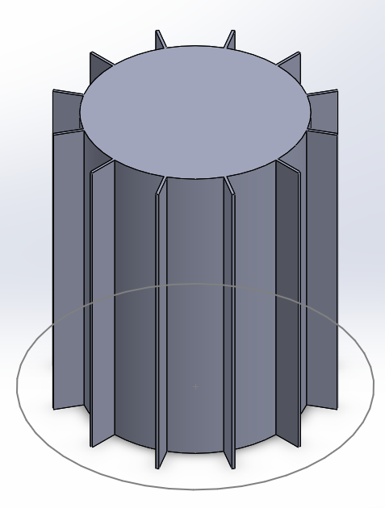
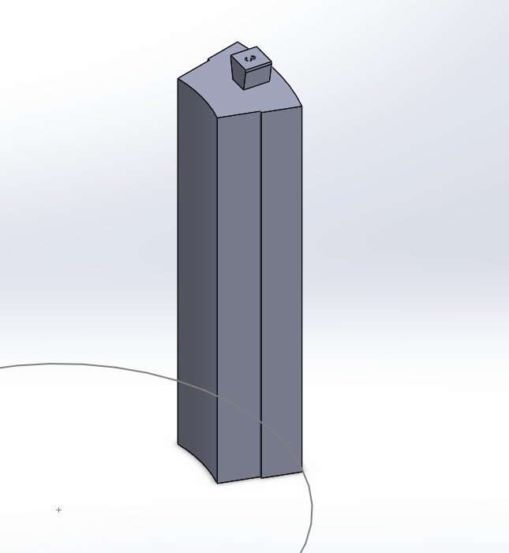
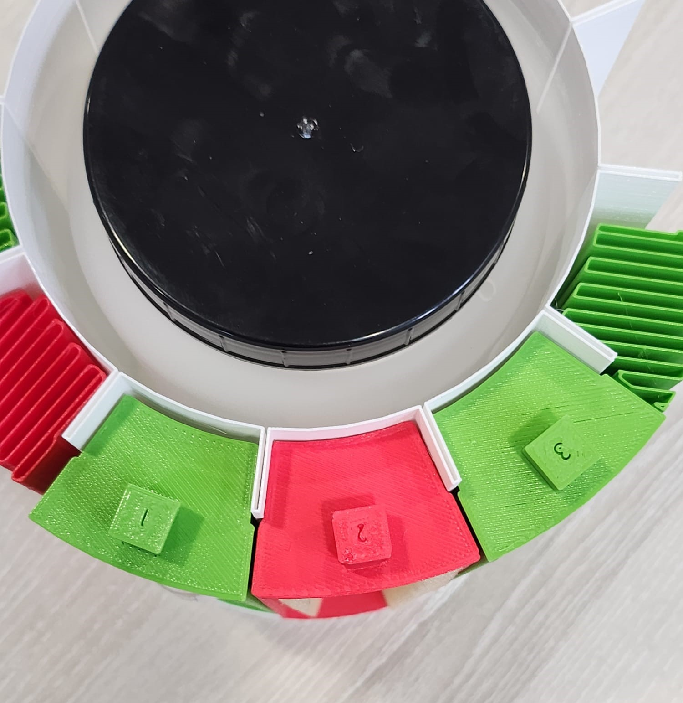
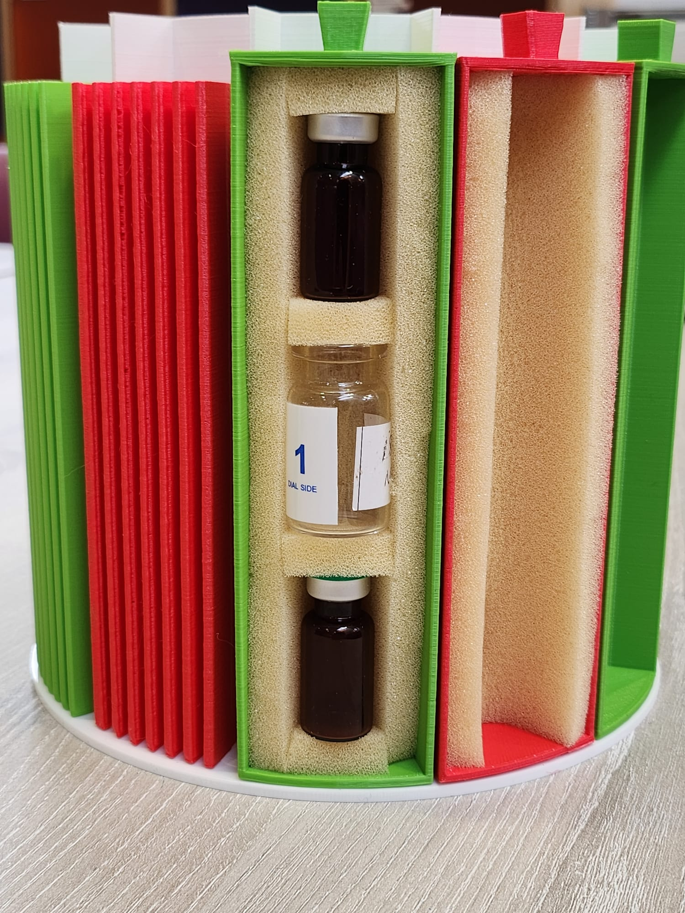

# Final proposed carousel design
Article by Caio Bezerra, help from Olivia Ambler

## Design finalisations
After the technical sketches and prototyping done by Olivia, we worked together to create the cad model, and work out appropriate dimensions for each design, and chose which potential sketches were the best options. Looking through, we determined that having all the vaccines in one section which can be accessible would not affect the thermal design very much if we were able to only have the used vaccines directly exposed to the outside at any given time. This will present a challenge to kitty as to how to ensure the door can remain closed when not in use, however this was a user error issue which we decided would not affect the other benefits of the smile enough that it would change what makes the design so good.

 

## CAD modelling
We began the cad modelling by creating a design for the carousel. the fins were modeled as 1.5mm apart, and 12 sections were chosen to be how many compartments we had. The beenfit of this design is that we do not have to sacrifice a compartment to be a stopper for the door, letting us maximise the number of compartments. While the difference in angles means that these can no longer be used in the big smile, it let us keep the arc length the same between fins, which we decided would be more important to get right to fit the vaccines. We then decided to make the carousel 160mm high, as the bottle was 155mm, and expanded by 3mm upwards when frozen.

 
We then looked at making the compartments. Taking inspiration from the original design meant to slot in to the ribs, and adapting it to work with our shape. The inner and outer curvatures were 110 and 170mm, and instead of clips, we used small receses in the outer face of the carousel so that the compartme could be next to each other. 
To ensure the compartments stay securely in the carousel, small divets for magnets would be put in the base of the compartment and the carousel so that they can snap back in place. Due to time constraints, we were not able to prototype this, but it would not be hard to add.
The compartment is designed to be very easy to manufacture, and very easy to produce. The entire shape is faceted, and the top handle is flat and so the entire piece could be made with a single 2-part injection mould.
The handle also has a number recessed into it for vaccine tracking, however this would not be feasible in a real production run, so it could instead be printed on the top, or printed on the outer shell. This would be somethine else that kitty would look at.

## 3D Printing
After modelling each section, we 3d printed them to see how it would fit together. A tolerance of 0.5mm was added to make sure they fit, but in retrospect this could have been smaller to get an even more snug fit.
 

The containers fit very close, and overall this would b ea completely feasible design in pracise. The carousels slide out very smoothly due to the lack of friction, and having an outer wall with magnets at the base would let the vaccines be very easily taken out and loaded in.

To print the carousel, vase mode was used. This is a mode that traces the outline of any stl file, and prints it as one long spiral. This makes the print go by much much faster, as there is only a single wall, and while it is quite weak, it allows us to test the assembly well enough with the bottle in the middle.

To counteract some of this weakness, we laser cut a circular base to glue onto the bottom of the carousel, which let us test the design more easily, and gave us a more rigid prototype which is more ready for showcase

 
The inside of each carousel was then lined with foam. This let us test how the vaccine capsules fit, which turned out to be perfect. The thickness of the foam is variable, and so some options could mean that the vaccines were too loose, however for our layout we were able to fit bottles from 13mm-22mm in diameter with foam that was 9mm thick. 

A key upside of the design is that it also maintains the modularity of the original design, where if needed, syringes and needles can be carried in the same capsules, as they would also have a snug fit, and would be needed for a round trip.

The outer diameter of the carousel is the same as that of the lid, meaning that we can reuse the same design for them, simplyfying the production as these pieces would not need to be made. Since the carousel is now taller than the original smile, and we are keeping the lid, the whole box will be taller than it is wide, and so this will need to be further explored, and will benefit from the modulatiry of the straps. This would be something to be handed off to kitty, the project supervisor, to have a look at when bringing some of these ideas to market.