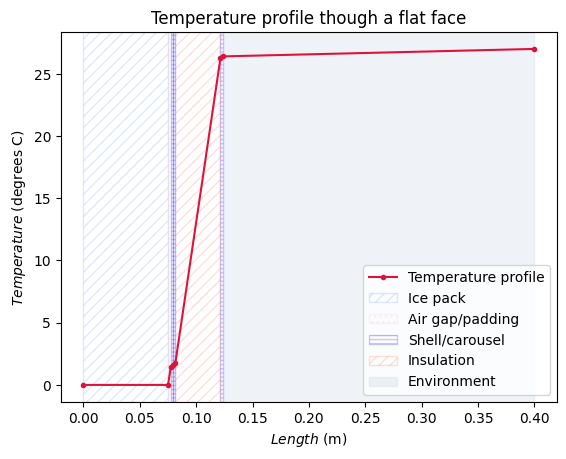
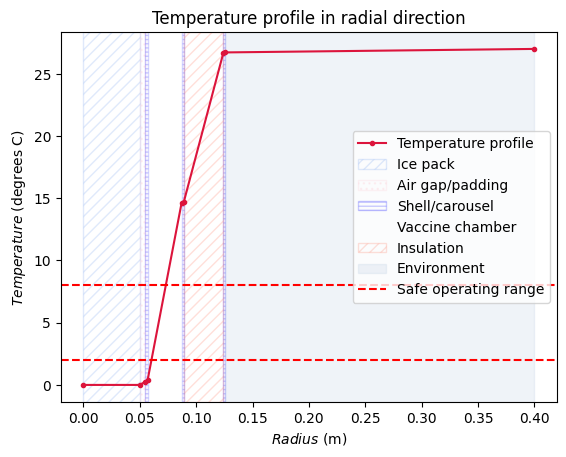
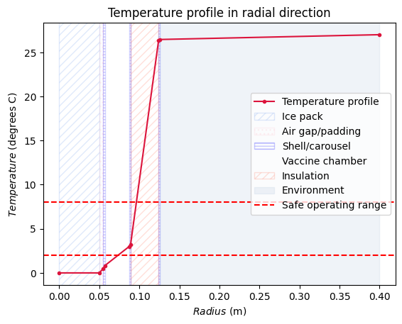

# Thermal analysis of proposed final design

The final design will use the same insulation material, with the same thermal properties and thermal conductivity of 0.23 W/mK, and ABS shell as seen in the origional larger smile design.

The smaller smile has been designed to be compatible with the circular lids of the larger smile, fixing the insulation above and below the ice pack as 4cm thick. The radial insulation thickness can be reduced to 3.5 cm and can be axisymetric unlike in the origional smile design due to the removal of the side door. This reduces total volume significantly. The inner carousel chamber holding the ice pack will be lined with 0.5mm thick compressive, thermally conductive foam or heat pads. For the purpose of this analysis the thermal conductivity of this material will be 0.3 W/mK. The gap above and below the ice pack is 2.5mm.

## Inputs
T_atm = 27 degrees C  
T_ice_avg = -10 degrees C  
Ice bottle radius = 5cm  
Ice bottle height = 15cm  
Vaccine chamber radial dimension = 3cm  
Insulation thickness in radial direction = 3.5cm  
Insulation thickness along flat faces = 4.0cm  
Air gap above and below ice pack = 0.25cm  
Air gap around ice pack = 0.5cm  
lambda_shell = 0.18 W/mK for ABS shell  
lambda_ins = 0.023  W/mK
lambda_gap = 0.3 W/mK

## Results
### Lower bound for rate of heat transfer - assuming just conduction in air gap

The temperature profile from the top or bottom of the ice pack, out through one of the two hexagonal faces is shown below:
 
 The rate of heat transferred from the two flat faces is, **Q_dot_l = 0.670 J/s**.
The height of the mini smile with insulation thickness of 4cm is 22cm, so has a lightly greater improvement on the large smile in this dimension.

The temperature profile from the ice block to the rectangular walls, in a radial direction is shown below, with only conduction effects considered in the air gap.
 
 The rate of heat transferred from the radial face is, **Q_dot_r = 1.286 J/s**.
The diameter of the small smile with 3.5cm insulation is approx. 25cm which is a reduction of 7cm from the large smile.

This shows the face limiting the cool life is the radial face as in the large model.
By approximating the box as the radial and linear resistor systems in parallel the total heat transferred out of the cooler is,
**Q_dot: 1.956 J/s** giving a cool life, with the vaccines below 8 degrees C, of **63.5 hours**.

### Upper bound for rate of heat transfer - assuming conduction and convection in air gap

The temperature profile from the ice block to the rectangular walls, in a radial direction is shown below, with convection effects now considered in the air gap as well as conduction.
 
 The rate of heat transferred from the radial face is, **Q_dot_r = 2.491 J/s**.

The total heat transferred out of the cooler is, **Q_dot: 3.161 J/s** giving a cool life, with the vaccines below 8 degrees C, of **39.3 hours**.

This implies the true cool life of a small smile will lie between 39.3 hours < t < 63.5 hours. This suggests that the 3.5cm radial insulation, with the 4cm insulated lids, would provide a sufficient cool life for the shorter and up to 24 hour last mile journeys. The average temperature of the vaccine chamber also lies between **2 degrees C and 7.5 degrees C** which is within the suitable range for vaccine storage.

