# Miniature SMILE Configuration Design
Article by Olivia Ambler

## Objectives

To consider several layout options for the design of the miniaturised smile and select a design to take forward to the prototyping stage.

### Desired functions

The design **MUST** perform the following funtions:
* Keep vaccines cool for up to 24 hours
* Keep vacines within the range from 2 - 8 degrees C
* Hold vaccines in fixed arrangement all equidistant from the centralised ice pack
* Have vaccines easily accessible for administering of vaccines
* Hold ice bottle in the centre of the ice bottle chamber (inner carousel)
* Provide easy access to ice pack for removal and freezing before each use

The design **COULD** perform the following functions:
* Have removable carosel parts for improved ease of cleaning compared with origional smile
* Have a symmetrical shell design so it can be made form to two identical ABS parts as in larger smile, reducing manufacturing costs
* Have self closing door
* Have compartmentalised design for easy location and labelling of each vaccine

## Analysis of current design

In the current large smile design, the carousel is fixed and cannot be removed only rotated, when the box is fully assembled as it would be in use. The sketch below shows the key components involved in holding the carousel inside the smile and allowing it to rotate. 
 
  The design consits of two identical outer ABS shell halves which could be sheet fomed using the same mould. The isulation is CNCd and fit inside each half, and an internal shell is fit inside the inslation. The two halves are screwed together once the carousel is in place. Because the insulation material is fragile and is directly exposed to the environment when the halves are separated, the carousel cannot easily be removed in service for cleaning.

Images of the large smile carousel, base inside one of the shell halves (including insulation and inner shell, and with bottom lid fitted), and bottom lid that gets fixed to base of carousel are included below:
 
 
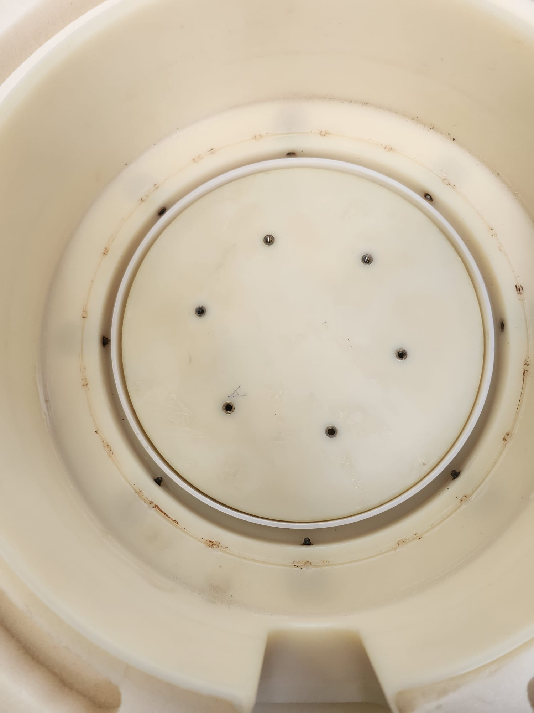
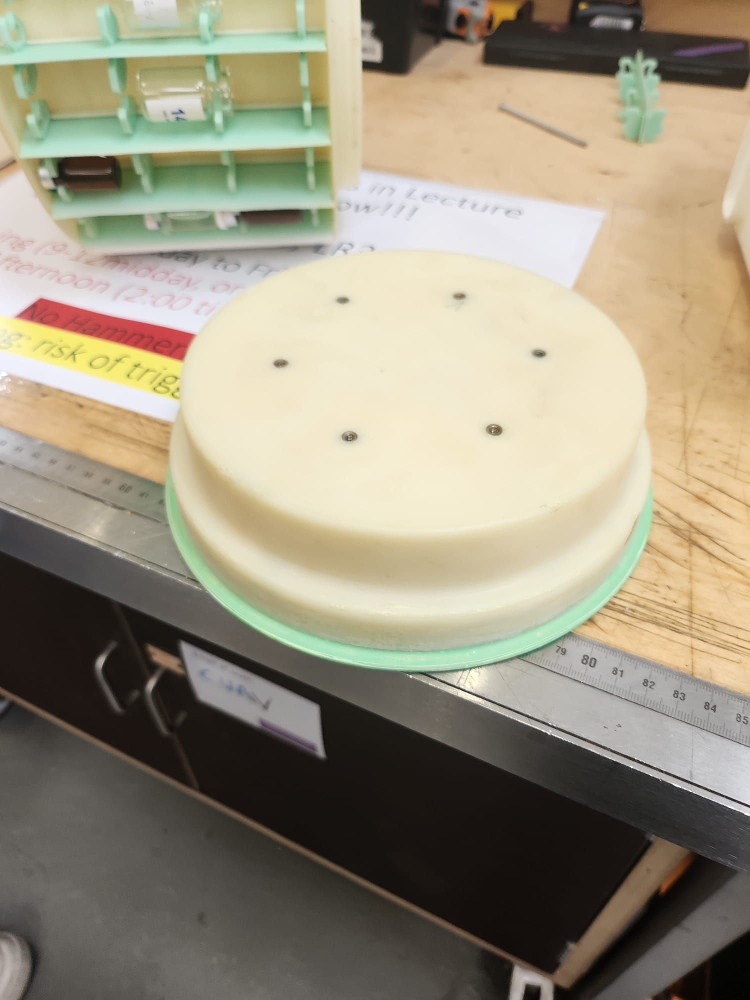
 As the two halves of the smile box are identical, both hexagonal faces have a hole for a 'plug' or circular door at the centre. One of these doors is shown in the images above, and is fitted to the carousel with 6 screws when the door is placed outside the box and the carousel inside, to hold it in place. This door can be rotated to directly rotate the whole carousel within the shell and change the vaccine chamber that is accessible through the side door. It is labelled with an inicator of which chamber is aligned with the door, and numbered for easy vaccine logging. 
 
 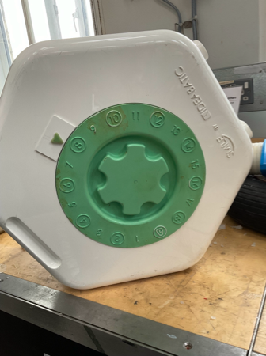

 A concentric recess is added in the inner shell with an equivalently placed lip on the bottom of the carousel to help centre it and locate the screws in the bottom lid. The lid on the other hexagonal face is removable with a simple locking mehcanism pictured below:
 
 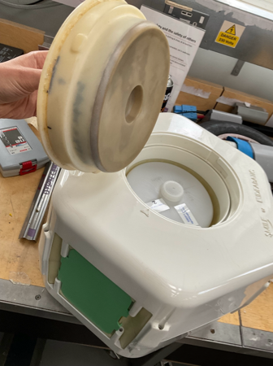
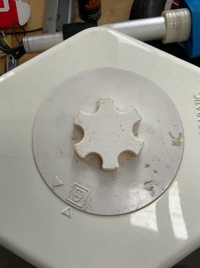

 This lid is removed to access and remove the ice pack bottle. Its diameter allows access to the inner carousel, keeping the outer carousel (vaccine carrying section) isolated from the environment.

The vaccines are accessed through a sprung self-closing door on one of the rectangular faces of the box. this allows acess to a single column of vaccines at once, keeping the others isolated from the environment. This design reduces the risk of healther leaving the cool box door open and warming all the vaccines whilst administering medications. The door is pictured below:
 
 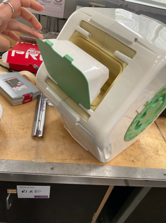

 Because of the prescence of the door on one of the rectangular walls, the insulation is not constamnt thickness radially around the ice pack, but is thicker at the side with the door to make up for thermal losses along the edges of the door, where there is no insulation.

Within the carousel inner chamber that holds the bottle ice pack, there is a small pin used to locate a bearing that fits a recess in the base of the bespoke ice pack bottle and helps to keep it central despite its expanding and shrinkage due to the state of melting. There is a similar recess in the removable lid to the chamber which helps to centralise the cap of the bottle. This lid is also made with a rubber, compressible contact to the bottle, to allow space for expansion and skrinkage.

## Potential configuration options for miniature SMILE

Different methods were considered for fixing the carousel within the outer shell. The aim was to make it easier to remove for maintenance 
and cleaning, without having to fully dismantle the whole smile and expose the insulation which could be easily damaged. 

### Fastened through outer walls

The option of screwing it in place from the 6 faces is shown as a sketch below.
 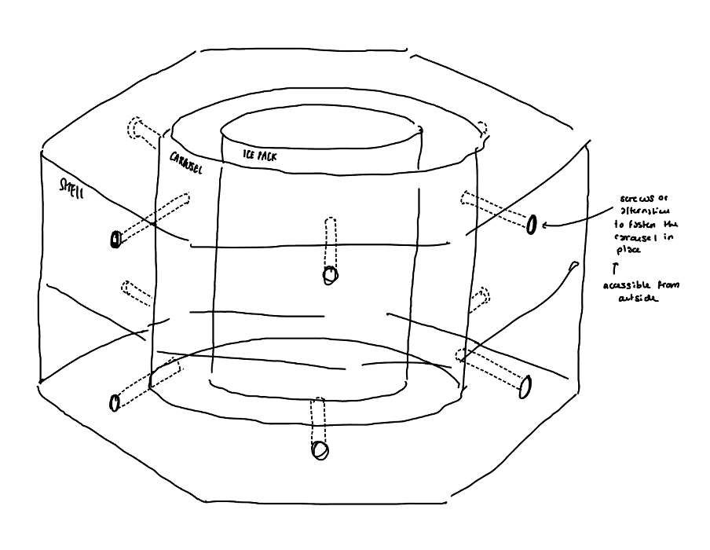

#### Pros
* Easy access to fastenings from outside of container to allow entire carousel removal for cleaning and part exchange without fully dismantling smile and exposing insulation which could be easily damaged
* Maintains symetry of design so it can be manufactured as 2 identical outer shell parts, reducing cost as 1 jig needed

#### Cons
* Screws or anything passing directly through insulation will produce thermally weak spots with no insulation, could drastically increase rate of heat transfer and and reduce cool life.
* May be hard to align screw holes of inner carousel with screws through
* concentrated load bearing

### Identical design to large smile (as detailed above)
This design involves the use of two clip in doors, as seen in the large smile's current design, one to fix the carousel inside and allow its rotation from the outside, and one to acces the ice pack chamber. This design would still require a side door to access vaccines.
 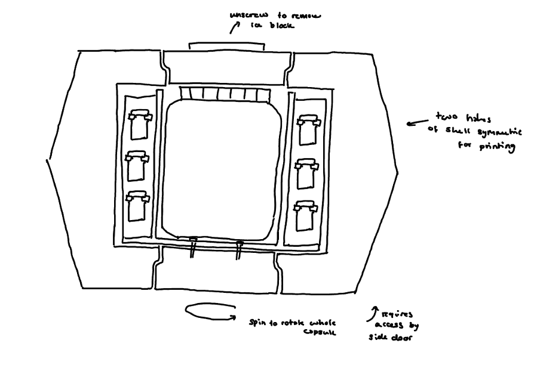

#### Pros
* Robust design when fully assembled and in use
* Easy access to ice bottle storage

#### Cons
* Requires complexity of access through side door
* Carousel cannot be easily removed for cleaning

### Larger lids design
This design works similarly to the large smile however the size of the lids in increased relative to the carousel, meaning that when the lid is removed both the vaccine chamber and ice bottle can be accessed. This design would still require a side door to access vaccines.
 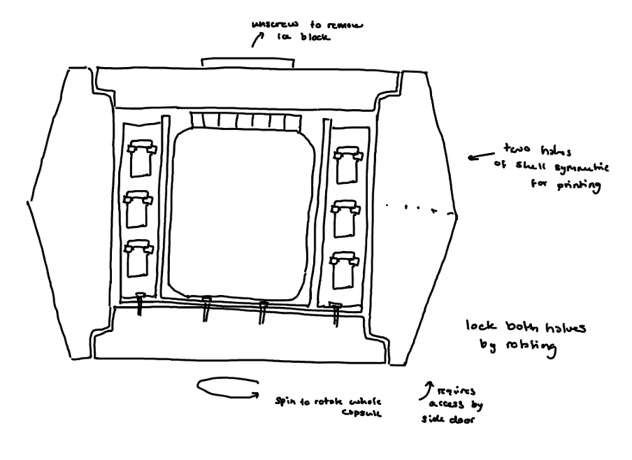

#### Pros
* Robust design when fully assembled and in use
* Easy access to ice bottle storage and top vaccines
* Is more modular as it can use the exact same lid parts as in the larger smile, as the diameter is 17cm. 

#### Cons
* Still requires complexity of access through side door and therefore different thicknesses of radial insulation at different edges to account for additional thermal losses through door
* Carousel cannot be easily removed for cleaning
* All vaccine chambers exposed to environment when lid removed to access ice pack
* larger lid could have negative effect on thermal properties through hexagonal faces
* Larger lid would have a larger circumference gap between lid and shell, with no insulation, so decreased thermal performance.

## Potential screw in capsule configuration options for miniature SMILE
Two locking mechanisms are considered for a design in which the side door is removed and the entire carousel, bonded to the top lid, and be romoved as one piece. The first is through fastening the top lid, either with a thread design or simple locking design as seen on the current larger smile lids.

 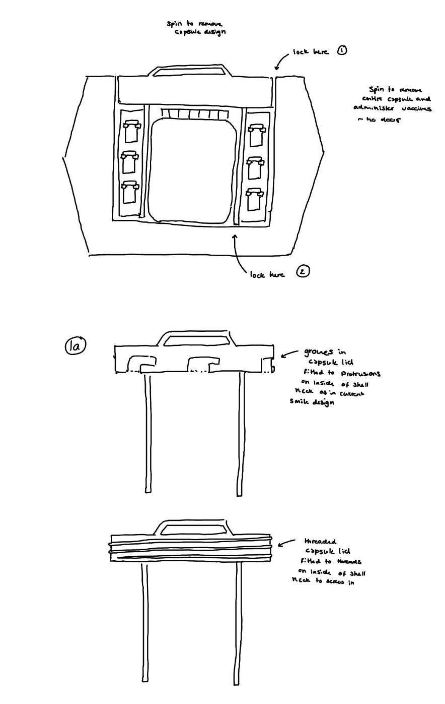
 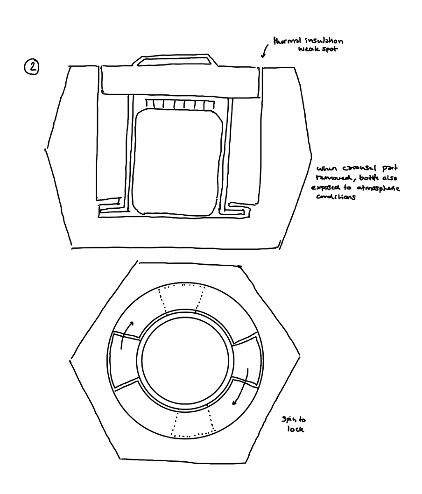

#### Pros
* reduced number of parts in design significantly
* beneficial simplification for miniaturisation of design
* carousel can be removed for easy cleaning

#### Cons
* reduced robustness of design as it is only fixed in place at either top or bottom
* second design significantly increases complexity of inner shell shape
* all vaccines are exposed to environment when only one will be used

### consideration of alternative door design

The door size could be increased as the side area of the miniature smile would be significantly reduced compared with the current smile
 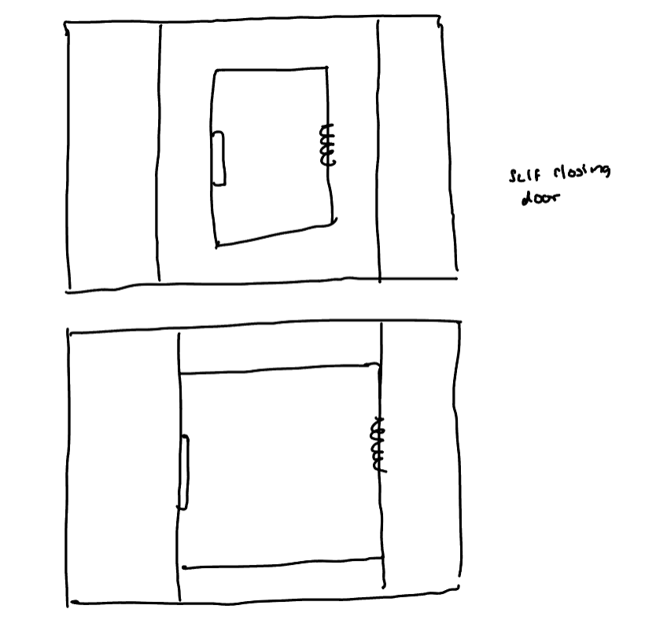

## Alternative drawer carousel designs

### Rotating lid, drawer design
The following design is one with a rotating top lid that has a hole for acessing compartments 1 by one as it is rotated.
 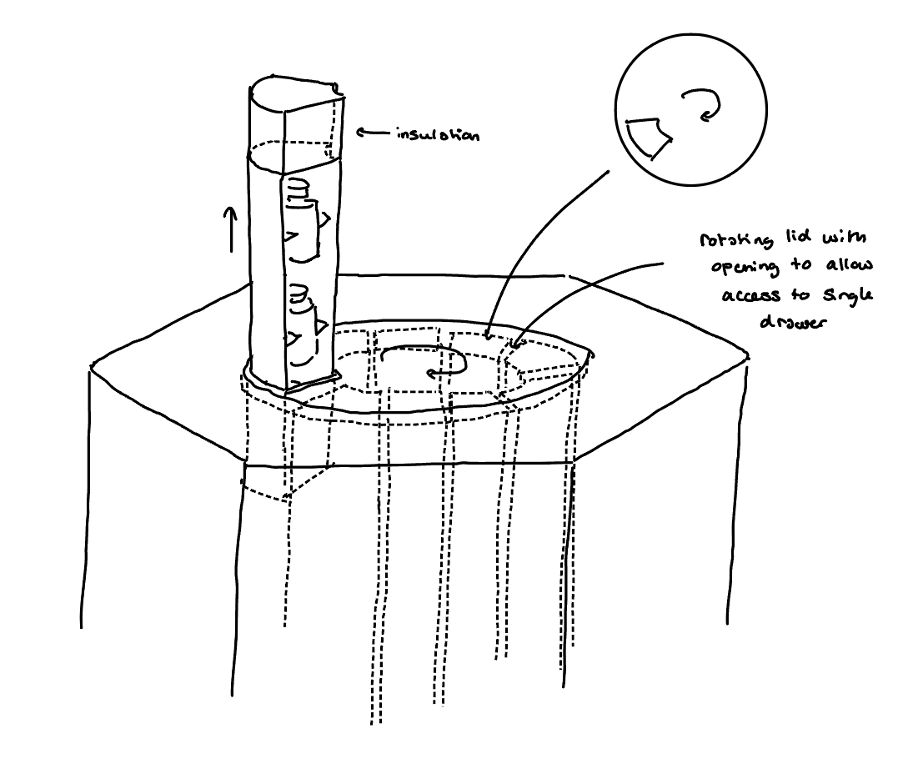

#### Pros
* Only one set of vaccines is exposed at any one time
* Side door is removed so radial insulation can be axisymmetric and 

#### Cons
* Each draw has to include its own section of insulation above it, this will be detrimental to the thermal insulation above the vaccine chamber as the insulation will have many gaps between drawer sections
* more design would have to be done to determine how the ice pack could be easily removed for freezing

## Removable lid, drawer design
The following design has a removable lid, with the same dimensions of that in the larger smile, and the carousel consists of a number of drawers that can be removed individually.
 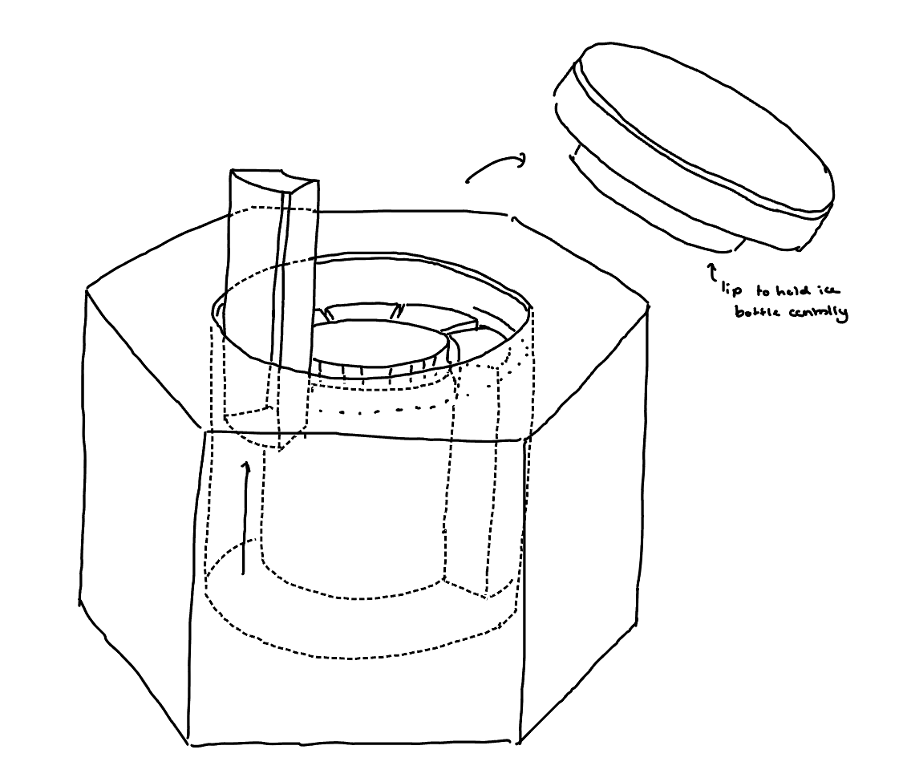

#### Pros
* reduced number of parts in design significantly - removed door
* beneficial simplification for miniaturisation of design
* carousel components can be removed for easy cleaning
* symmetric design for easy manufacture
* Insulation can be the same thickness the whole way around, as there is no side door, reducing size

#### Cons
* Insulative layer removed from ends of all chambers when one is retrieved - however the individual chambers will remain shut and reduce mixing with outer air

  
Different methods for holding the vaccines within individual drawers are considered below.
 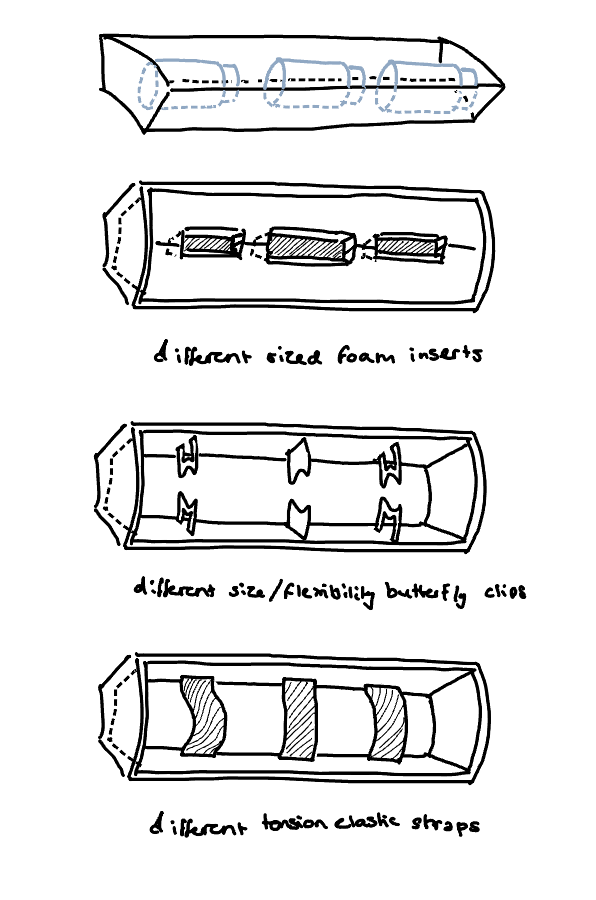
 This design will be discussed further in the cad section as it was the design taken forward for prototyping.

### Alternative handle designs for draw mechanisms

 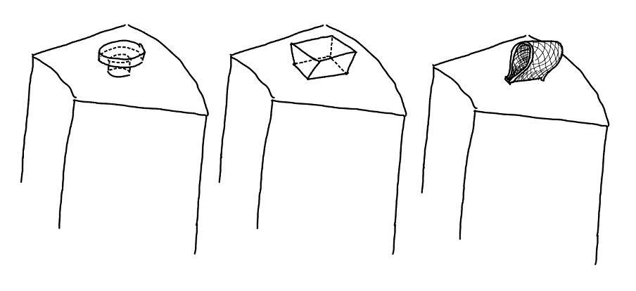

## Centralising ice bottle in chamber

In the new ice pack, the bottle lid does not change shape significantly when melted vs frozen, so the lid could be used to fix the bottle in the centre of the chamber. If a ring of rubber-like material is bonded to inside of the capsule lid with the dimensions of the bottle cap, this could fix it in position within the chamber, ensuring equal cooling of vaccines on all sides of the bottle.

