# Rapid prototyping of the carousel 
Article by Caio

The prototyping began by creating a table which listed the necessary functions and features of the carousel. This let us get down to the basics, and gave us a lot of areas to work from. These jumping off points let us quicklly change and iterate upon our ideas, while having a well defined baslien to fall back to to ensure the changes were so drastic they no longer served theor original purpose.
lmao
## Importance table

<table>
<thead>
<tr>
<th>Part</th>
<th>Reason</th>
<th>Improvement</th>
<th>constraints</th>
<th>Adresses what need</th>
<th>Importance</th>
</tr>
</thead>
<tbody>
<tr>
<td>Attachment mechanism of vaccine to carousel</td>
<td>Needs to hold vaccines</td>
<td>Could try looking at different materials, doesnt need to be slotted in the same way, could be an elatic band, or some foam to hold it in place</td>
<td>Needs to have enough friction to hold in place without falling, does not need to be as soft as before, since journey is less rough.</td>
<td>Adresses the form factor, as more efficient use of the space would allow for a smaller pack. Also can address teh modularity and compatibility with the original smile</td>
<td>High</td>
</tr>
<tr>
<td>No. Vaccines</td>
<td>Needs to be maximised since the other constraints are already being met for cold time. Can always underfill, so need to think of a cheap and versatile way to store more. At least a certain number must be met, or too many will need to be brought and the pack will be at capacity</td>
<td>Could be as simple as making the carousel smaller to fit the 1L box.   Could look at improving attachment mechanisms to add more vaccines? Or make it more versatile.   Maybe a sock/strap type thing like in a toolbox to make it really thin and versatile</td>
<td>Maximise  Each vaccine could take 20-30mins. Over one full day (12 hours?) would need at least 24</td>
<td>Probably fewer vaccines than SMILE, but will make it more portable and easier to transport while still having the maximum utility  Current SMILE has a very large ice pack, and not all slots are always filled (currently 3 vaccines per section with 18 sections).   Smaller journeys will need less vaccines as they would probably be limited by the number of patients in one day</td>
<td>High</td>
</tr>
<tr>
<td>Simplicity</td>
<td>Easily repairable means if something goes wrong, it can be fixed quickly and wont waste the entire pack. increases teh usable life and effectiveness of the smile</td>
<td>Core benefit of current SMILE is the lack of human error possible, but these can be solved for shorter journeys as the human error would be less critical</td>
<td>Must keep single ice pack, and must try and keep some form of automatic door closer</td>
<td>Human error can cause vaccines to be rendered completely ineffective a lot quicker, and so need to try best to prevent this from happening. Not the end of the world as a chcecklist can serve a lot of the same functions</td>
<td>medium-low</td>
</tr>
<tr>
<td>Modularity</td>
<td>Able to be used on the big box</td>
<td>reduce the number of components? Could join multiple of the  green rows together to allow for fewer parts to be needed. Can also look at carrying syringes and needles inside the carousel, as that would make the storage far more efficient for trips where not that many vaccines are needed</td>
<td>Must be easily cleanable or cheaply replacable as it is still a medical instrument, and cannot have chemicals leeching into vaccines etc.</td>
<td>Compatible with the original design of the holders, would neeed a whole new injection mould but could potentially be repurposed for both if a large redesign is to be had.</td>
<td>Medium</td>
</tr>
<tr>
<td>Weight</td>
<td>Needs to be transportable so cool box can reach difficult-to-reach locations, though less rough terrain so can give up SOME rigidity</td>
<td>Reduce dimensions since weight only goes down by the cube.  Thin insulation, although insulation is mostly air so limited effectiveness</td>
<td>Under 10kg</td>
<td>Transportable, probably less durable, but enough to withstand standard use</td>
<td>High</td>
</tr>
</tbody>
</table>

This table allows us to then work in some new ideas which can be quickly tested and prototyped. Some ideas are more basic, and some are far more complex, but they all attempt to solve an issue while keeping in mind the ideas before 

## Discussion of possible sketches
 

 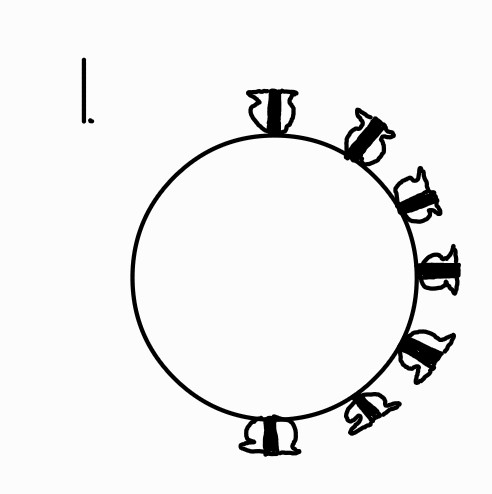

### 1. 

Simply making the carousel smaller. It works well as the design is already there, and would be easy to assemble and repair, but  form experience it is very easy to pull off by accident, and takes a few minutes to get it back in. It also means that the new smile will need all the extra space associated with the brackets. It also means that teh current inefficient door design will remain, thickening whatever side it is on.

 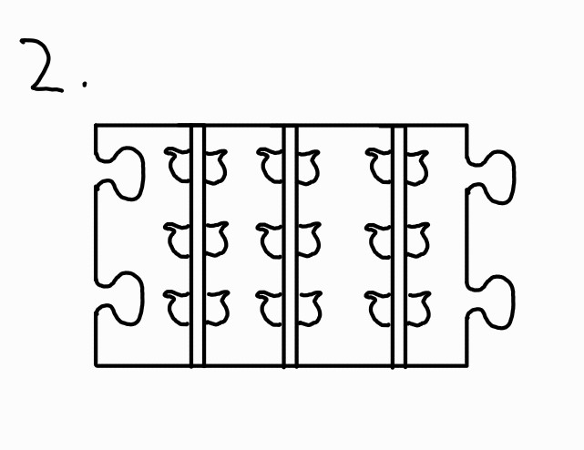

### 2.

Idea to make it one long slab, which can be modular for any size of smile. Puzzle attachment is probably not the most secure, but allows complete modularity without much change in the design. This would hypothetically allow for different sections to be added with different or more specific designs, which allwos for versatility on a trip by trip basis

 

### 3.

Leading on from the modular idea for more than just vaccines,Having a capsule for needles etc is something that can be explored. It can fit in the same gap as the current butterfly attachment ribs, but can be used to carry more than just the vaccines. May need to redesign butterfly to have some halves, as this would take up the slot of 3 spaces worth of vaccines. Solves a large issue since currently the bag is used to carry the extra bits, but is just too big and expensive to keep in the miniaturised smile.

 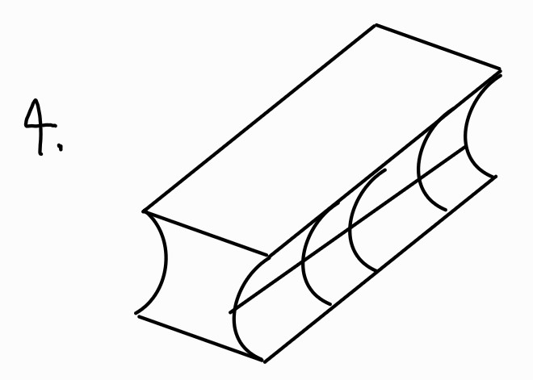

### 4.

Using foam inserts. this is a lot simpler, acts as insulation, and is incredibly easily repaired. Will break a lot quicker with use, which may be ok if the hospital is slightly well off and the foam is cheap enough. The foam can also have a slit on the bottom to attach to the current design. Could be an issue as the foam is porous, and would make direct contact with the vaccines, but can also be easily cleaned after a few uses.

 

### 5.

Same benefits and issues as before, but is more versatile so can stuff anything within the small crevices of a thicker foam wrapped around. 

 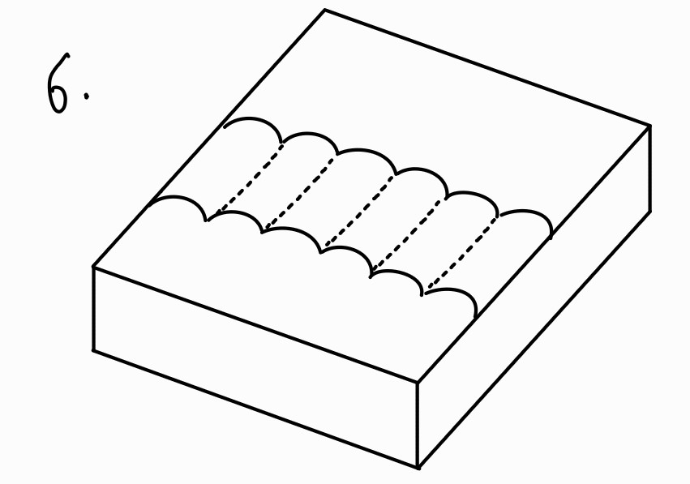

### 6.

Straps sewn onto foam could work quite well. If careful with it will last a long time, and can be easily fixed as the materials needed woul dbe very commonly found. Would be very cheap to produce, incredibly modular, much more versatile, with a much flatter profile. Startup cost much lower as nothing would be moulded brand new, but might end up being more expensive per part so would need to look at costing. The coam would have no gaps and so would act as a very good insulator, which if thin enough can keep the ice pack colder for longer without preventing cooling in the chamber.

# Physical Prototyping
After these sketches were done, some of the ideas were made into physical prototypes to test their effectiveness, and to outline any issues which may not have been apparent in the first run through

## Puzzle Piece Design
The first to be  made was the puzzle piece design. This was 3d printed out of a flexible filament which allowed us to simulate the felxible rubber that the attachment is already made of. We then placed these in the grooves to test how one flat piece would work with both designs curvatures

 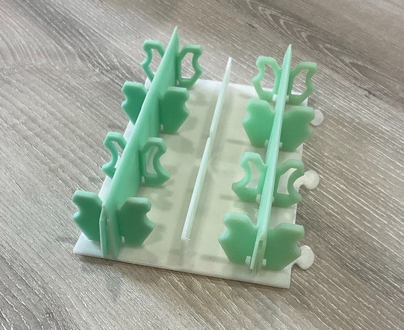
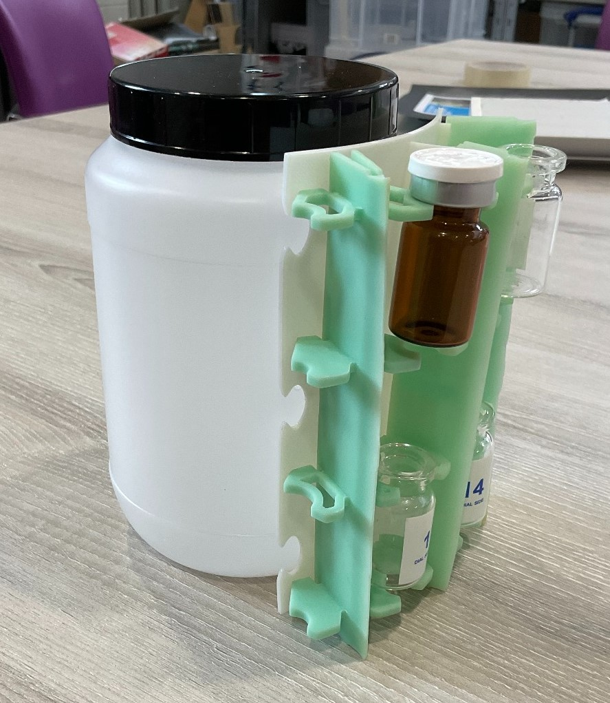

Puzzle pieces were used at the edges to allow for flexibility and modulatiry with a potential future design. It also allowed the design to hypothetiocally be used for both the regular smile and the smaller smile if a redesign were to occur.

### pros
One major pro of this design is the high potential for modualrity. While the design is quite sensitive to small changes in curvature, the shallow curvature of the two sized shells means that it could hypothetically work for both. 
The vaccines fit quite well in this design, and as a proof of concept it functioned quite well.

### cons
THis design had some major flaws. Since the dimensions were modeled against the current design which is already curved, the rubber sections overlapped, meaning that it would not be very easily manufactured. The solution we came up with would be to  have a predetermined curve baked into the design, which would both make it fit more securely, and allow it to be manufactured, however this seeemed to be too much added complexity for a solution which had no major benefit over just repurposing the current green ribs in a smaller shell.

## syringe compartment
The next part to be tested was a compartment which would be able to slot into the existing design (but could be easily repurposed for the smaller one) which would be able to carry the syringes

 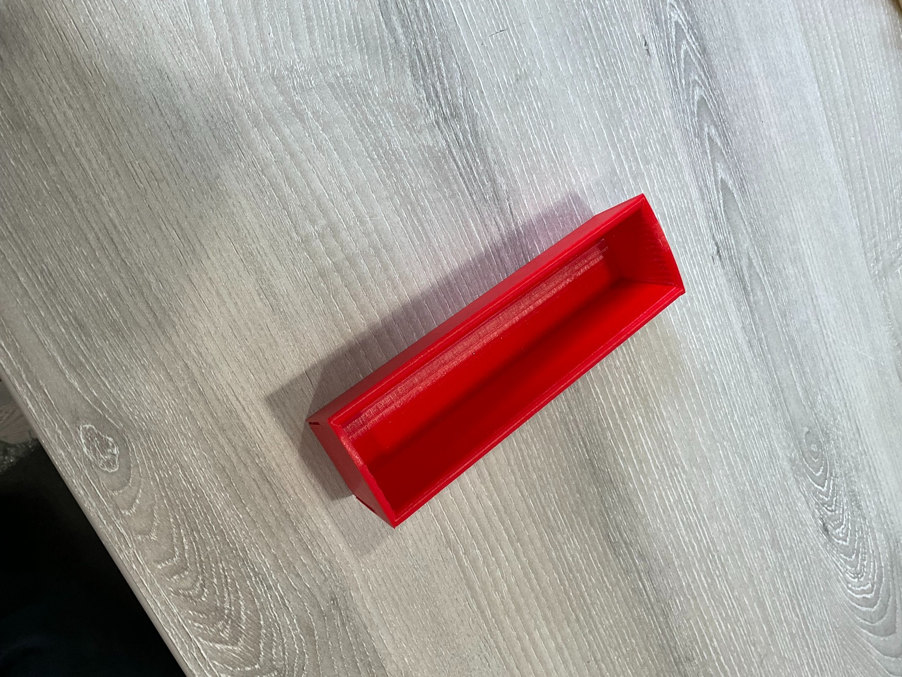
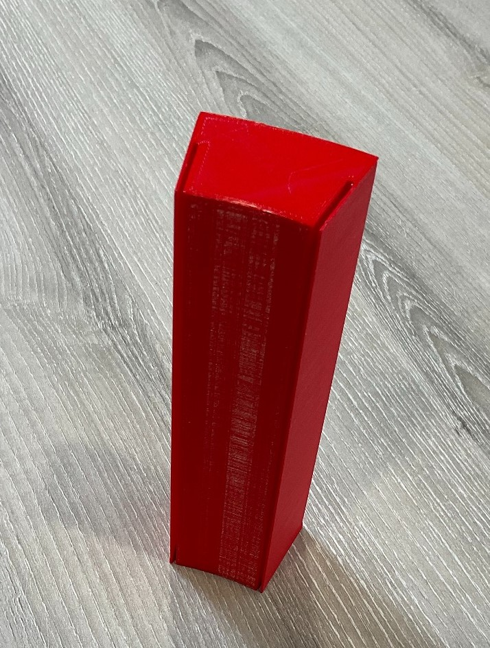

 
This worked quite well, as the inside had a fair amount of room for this. As you can see in teh right image, the small gaps were designed to fit into the carousel, and potentially a lid would be placed to cap teh end, however it would be difficult to open with the current lid design on teh outer shell.

 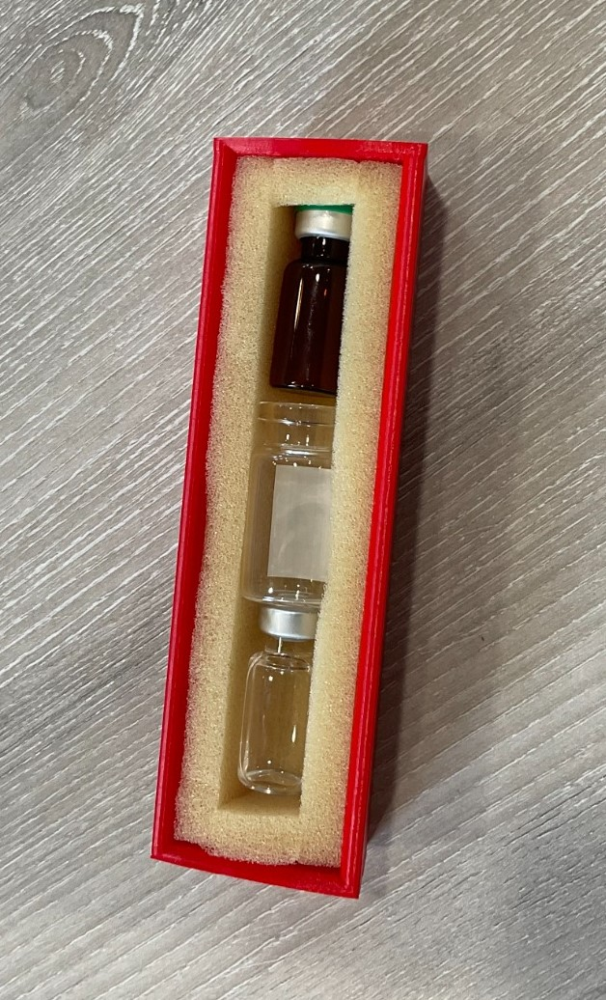

Olivia then took this design, and cut some foam to show how this capsule could then be used to carry vaccines. This was further explored in the final design we came up with, with each section being liftable, however it was not thought of at this point.

### pros
Pros of this design is that this smaller smiel can be more versatile in its use, which is needed when you would have smaller teams for these small trips, and les people can carry the extras such as the syringes and needles.

### cons
The main issues with this was that it would be too difficult to load and unload these sections, and the things placed in them would be free to move around, however this was rectified in the later revisions

## foam plate with elastic straps

The final quick iteration was the idea of a foam plate with elastic straps. Due to material availability, it was instead made with scraps of a tshirt, and some spare foam. 
To do this, Olivia cut up some fabric, and attempted two thin sections, and a thicker section, and sewed it directly onto the foam. The foam fared surprisingly well and did not rip, meaning this would be feasible to produce at a reliabe scale. 

 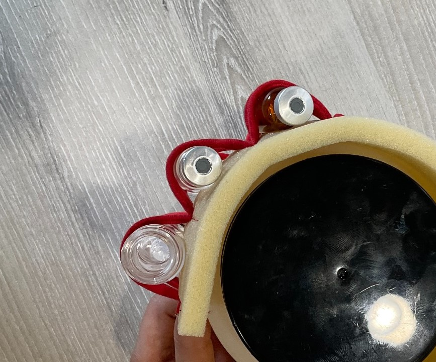
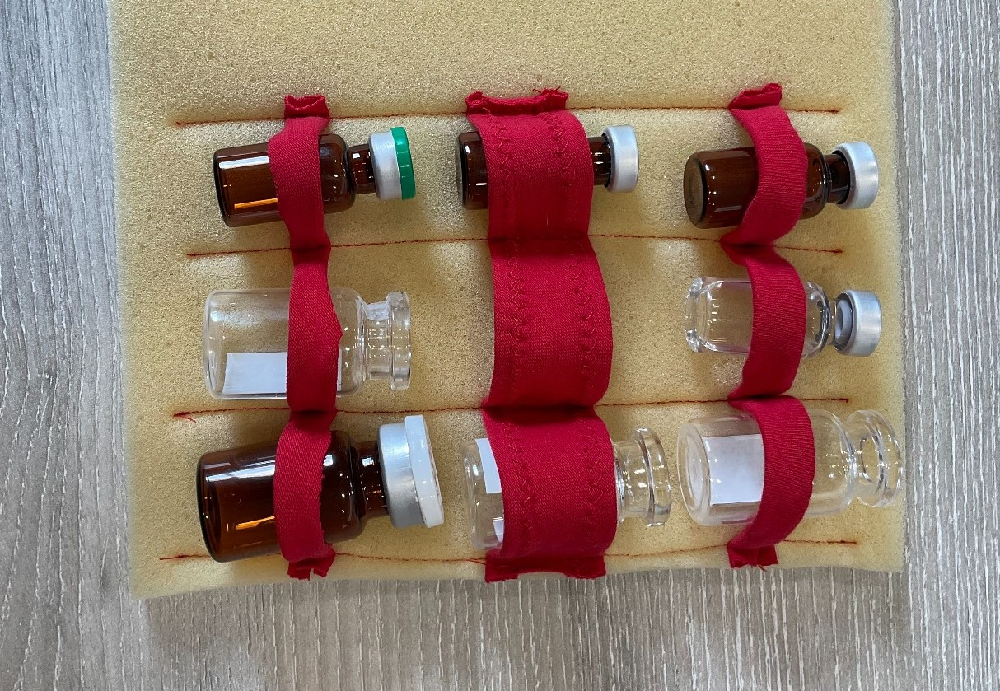

### pros
Some pros of this design is that it is not dependant on the curvature of the surface that it is on. Can be easily cut to different lengths for each size. It also holds the vaccines qure securely, and could be used for a much broader range of sizes
### cons
Cons are that the foam is porous, and could get quite dirty, which is sub-optimal when it it making direct contact with the vaccines. It could also end up being expensive to make this at scale, where an injection moulded part only has the startup cost and the miniscule material cost in comparison.

