# Heat transfer analysis
By Olivia Ambler

## Objectives

To perform a basic thermal analysis with variable input parameters that can be changed to investigate the effect of insulation thickness, ice block size, insulation material and ambient temperature on the cool-time and temperature range of the vaccine chamber for example.

The aim was to have a tool that could help investigate how much the insulation thickness could be reduced, and also enable the testing of insulation and shell materials with different thermal properties.

## Assumptions made to build code

The cooler was approximated as two simple 2D shapes for the heat transfer analysis. 

The hexagonal face of the cooler was analysed as a circle with a diameter equal to the shortest width of the hexagon. This ensures the analysis will produce an underestimate for the time taken to warm up, so the true model will only outperform the prediction provided by this analysis. On the full sized smile, the isulation is 7cm thick in the side with the door and 4cm thick in the far side. An average thickness was taken for the analysis, however this could be improved in further analysis.

The figure shows the network of thermal resistances used around the hexagonal face, to calculate the heat transfer out of the 6 rectangular faces of the smile cooler. 
 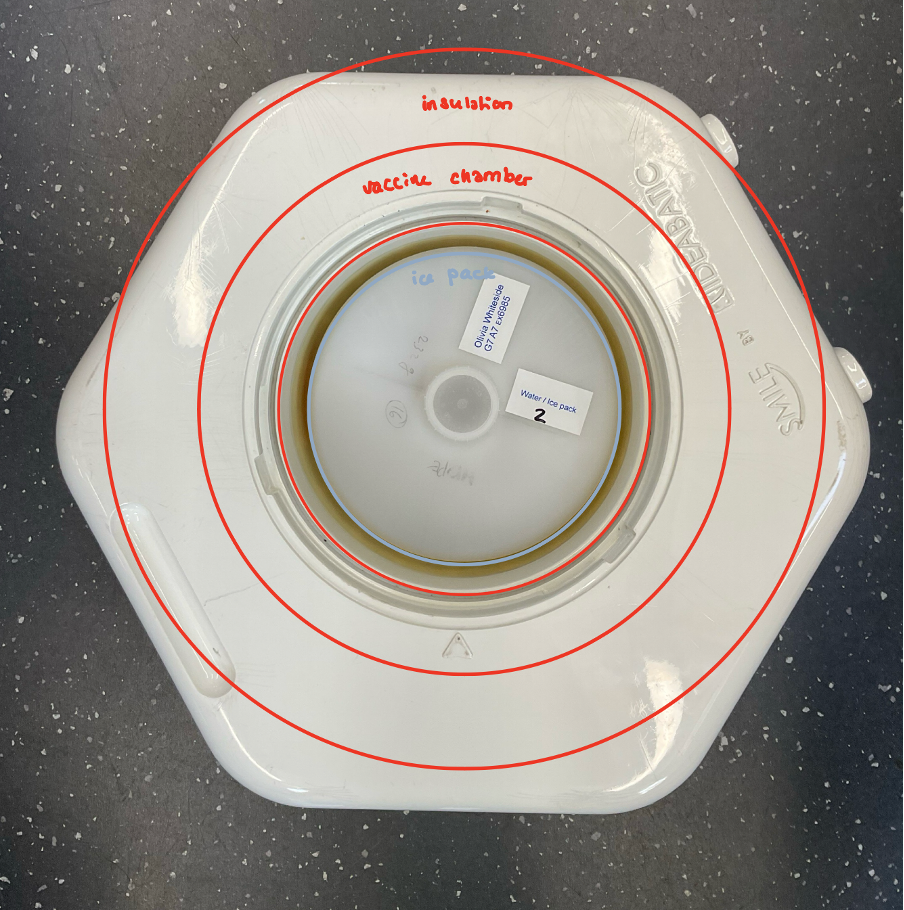
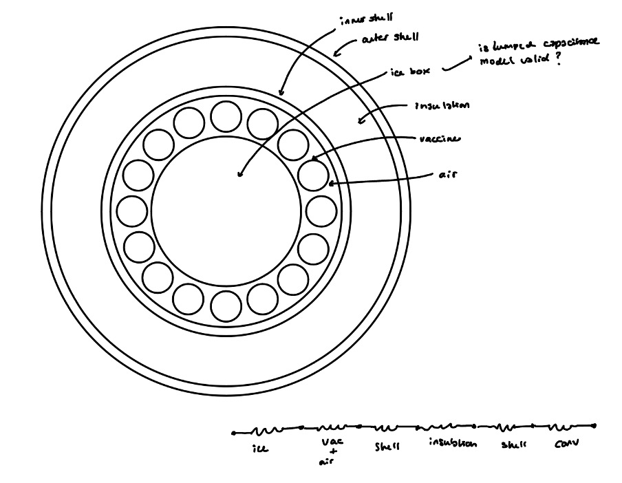

The following figure shows the resistor network of thermal resistances out of the flat hexagonal faces of the box, using a linear analysis.
 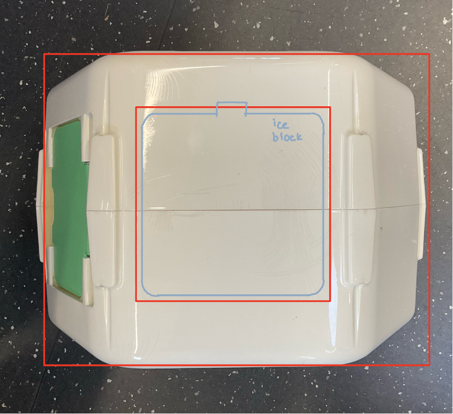
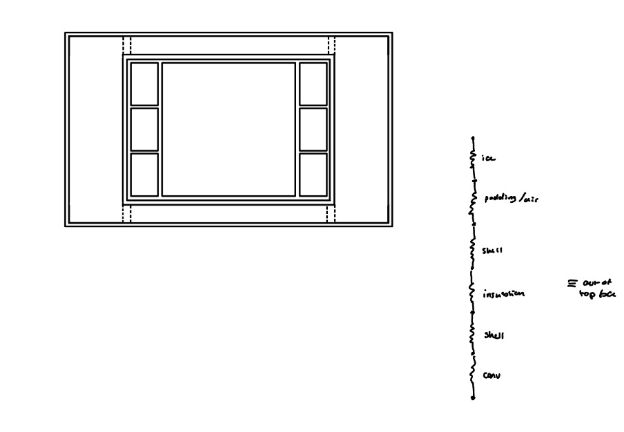

As heat is gained through both the flat hexagonal faces, the box was assumed symmetrical and two identical resistor networks were used in parralel to approximate the heat transferred through these faces.

To calculate the total heat transferred through all faces of the box the radial and two linear resistance networks were all used as resistances in parallel, with the total temperatre difference across the box(from T_atm to T_ice). The total heat ransfer required to melt and warm the ice to a temperature causing the vaccine chamber to exceed the limiting temperature of 8 degrees C for storage. This quantifies the amount of heat tranfer required to reach the end of life of one use of the cool box (i.e. use of 1 ice block before requiring refreezing). Dividing this value by the total rate of heat transfer from all faces gives an esimate for the cool-time of the cool box. 

The heat transfer rates were used with the individual section thermal resistances to find the temperature difference across each section which was used to determine the temperature at each interface between layers. These points were plottes with linear temperature gradients joining them to represent the gradient through each different material. These gradients in reality are unlikely to be linear, especially in the vaccine chamber gap, where mixing is expected and a more constant temperature somehweere between the two teperatures at the interfaces with shell material would be expected.

Further assumptions made include:
* The chamber cntaining the vaccines was assumed to have the thermal properties of air (the prescence of any vaccines was ignored).
  * Convective and conductive heat transfer were ananlyssed in paralell for the heat transfer in the still air of the vaccine chamber.
  * Assuming just conductive heat transfer gives a lower bound for the amout of heat transferred and an upper bound for the temperature in the vaccine chamber, whilst assuming convective heat transfer also, gives an upper bound for the annount of heat transferred from the cool box, and a lower bound for the temperature in the vaccine chamber and cool life.
* The thermal properties of the carosel were assumed to be the same as those of the ABS shell.
* The heat lost out of the hexagonal faces was assumed to happen over the area of the end of the iceblock and vaccine chamber

# Analysis of large box

## Inputs
T_atm = 27 degrees C  
T_ice_avg = -10 degrees C  
Ice bottle radius = 8cm  
Ice bottle height = 14cm  
Vaccine chamber radial dimension = 3.5cm  
Insulation thickness in radial direction = 4cm  
Insulation thickness along flat faces = 4.5cm  
Air gap above and below ice pack = 1cm  
Air gap around ice pack = 0.5cm  
lambda_shell = 0.18 W/mK for ABS shell  
lambda_ins = 0.023  W/mK

## Results
### Lower bound for rate of heat transfer - assuming just conduction in air gap

The temperature profile from the top or bottom of the ice pack, out through one of the two hexagonal faces is shown below:
 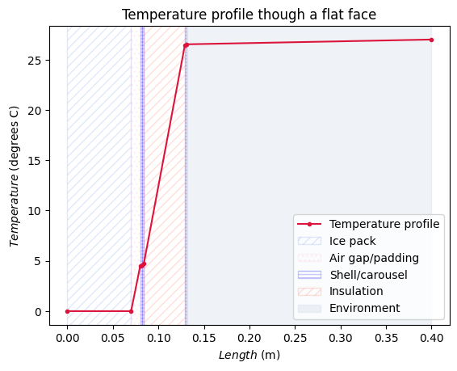
 The rate of heat transferred from the two flat faces is, **Q_dot_l = 1.036 J/s**.
The height of the big smile is 26cm.

The temperature profile from the ice block to the rectangular walls, in a radial direction is shown below. Two limits for the vaccine storage temperature have been shown in the figure as dashed red lines. This region is significant in the vaccine storage chamber as the average temperature of the chamber(taken as average, instead of linear temperature gradient as shown, because of mixing effects of air) must lie within these limits for the vaccines to be preserved.
 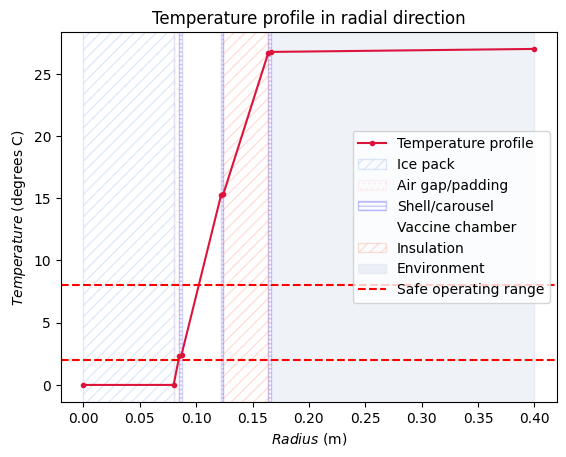
 The rate of heat transferred from the radial face is, **Q_dot_r = 1.542 J/s**.
The diameter of the big smile is approx. 33cm.

The greater rate of heat loss from the radial faces shows that the heat loss out of the radial faces is the limiting factor for the cool life. 
By approximating the box as the radial and linear resistor systems in parallel the total heat transferred out of the cooler is,
**Q_dot = 2.579 J/s**.

This gives a cool life, with the vaccines below 8 degrees C, of **115.1 Hours**.
The large smile should last approx. 120 hours, so this shows that the software does give an underestimate as expected, but also a relatively close estimate of the cool life, suggesting it could be a useful tool for analysis of a smaller box design.

### Upper bound for rate of heat transfer - assuming conduction and convection in air gap

The temperature profile from the top or bottom of the ice pack, out through one of the two hexagonal faces is shown below:
 
 The rate of heat transferred from the two flat faces is, **Q_dot_l = 1.036 J/s**. This is unchanged by the inclusion if convective effects in the air gap.

The temperature profile from the ice block to the rectangular walls, in a radial direction is shown below, with convection effects now considered in the air gap as well as conduction. Two limits for the vaccine storage temperature have been shown in the figure as dashed red lines. This region is significant in the vaccine storage chamber as the average temperature of the chamber(taken as average, instead of linear temperature gradient as shown, because of mixing effects of air) must lie within these limits for the vaccines to be preserved.
 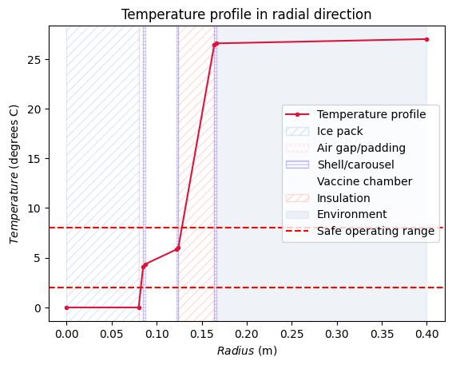
 The rate of heat transferred from the radial face is, **Q_dot_r = 2.772 J/s**.

The greater rate of heat loss from the radial faces shows that the heat loss out of the radial faces is still the limiting factor for the cool life. 
By approximating the box as the radial and linear resistor systems in parallel the total heat transferred out of the cooler is,
**Q_dot = 3.808 J/s**.

This gives a cool life, with the vaccines below 8 degrees C, of **77.9 Hours**.
This is a much lower estimate for the expected cool life of the smile coolbox, but gives a range in which the true value would be expected to lie. This value lies much further from the length of time Kitty said the the large box could stay cool for, (120 hours) suggesting both bounds are underestimates. This error could have been accounted for by the inclusion of the back pack bag that was used in practice with the larger smile however, as this would have added an extra thermal insulation layer, extending the cool life.

# Analysis of small box - 4cm insulation

The small smile box is a new design centred on the use of a smaller, off-the-shelf ice pack, which is a 1l bottle. Analysis has been based on this new icepack volume and shape.

## Inputs
T_atm = 27 degrees C  
T_ice_avg = -10 degrees C  
Ice bottle radius = 5cm  
Ice bottle height = 15cm  
Vaccine chamber radial dimension = 3cm  
Insulation thickness in radial direction = 4cm  
Insulation thickness along flat faces = 3cm  
Air gap above and below ice pack = 0.5cm  
Air gap around ice pack = 0.5cm  
lambda_shell = 0.18 W/mK for ABS shell  
lambda_ins = 0.023  W/mK

## Results
### Lower bound for rate of heat transfer - assuming just conduction in air gap

The temperature profile from the top or bottom of the ice pack, out through one of the two hexagonal faces is shown below:
 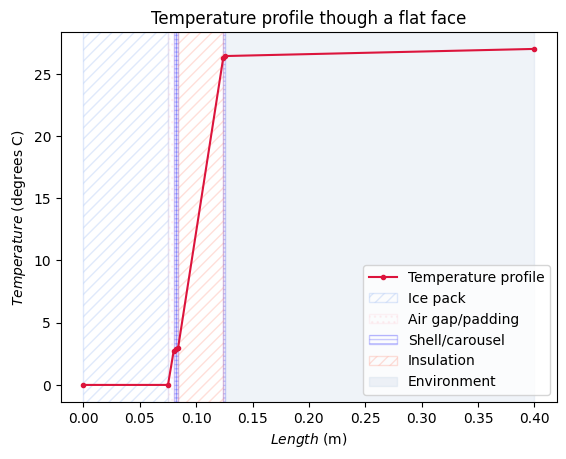
 The rate of heat transferred from the two flat faces is, **Q_dot_l = 0.637 J/s**.
The height of the mini smile with insulation thickness of 4cm is 25cm, so not much smaller that the origional smile in this dimension.

The temperature profile from the ice block to the rectangular walls, in a radial direction is shown below, with only conduction effects considered in the air gap.
 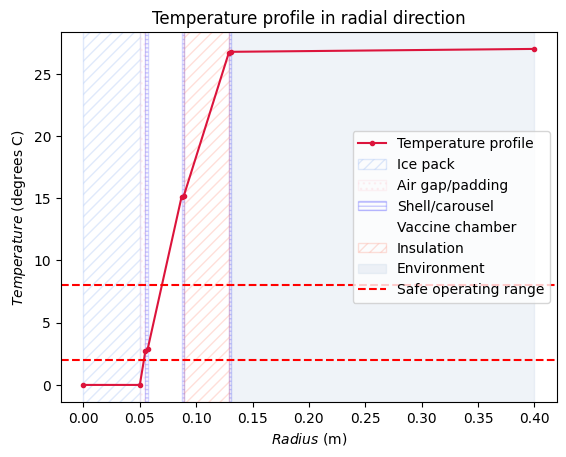
 The rate of heat transferred from the radial face is, **Q_dot_r = 1.130 J/s**.
The diameter of the small smile with 4cm insulation is approx. 26cm which is a reduction of 7cm from the large smile.

This shows the face limiting the cool life is the radial face as in the large model.
By approximating the box as the radial and linear resistor systems in parallel the total heat transferred out of the cooler is,
**Q_dot: 1.767 J/s**.

This gives a cool life, with the vaccines below 8 degrees C, of **70.3 hours**.

### Upper bound for rate of heat transfer - assuming conduction and convection in air gap

The temperature profile out of the two hexagonal faces is unchanged between the upper and lower bound analyses, so only the radial heat transfer analysis and resulting total heat transfer rate and cool time are included for upper bound from this point onwards.

The temperature profile from the ice block to the rectangular walls, in a radial direction is shown below, with convection effects now considered in the air gap as well as conduction.
 
 The rate of heat transferred from the radial face is, **Q_dot_r = 1.938 J/s**.

This shows the face limiting the cool life is the radial face as in the large model.
By approximating the box as the radial and linear resistor systems in parallel the total heat transferred out of the cooler is,
**Q_dot: 2.574 J/s**

This gives a cool life, with the vaccines below 8 degrees C, of **48.3 hours**.
This implies the true cool life of a small smile will lie between 48.3 hours < t < 70.3 hours. The use case for the smaller smile requires it to last up to 24 hours for shorter last mile journeys. This criterion is met by the design with the off the shelf smaller ice pack and 4cm thick insulation above, below and radially surrounding the ice pack and vaccine chamber.

In all analyses so far, the radial heat transfer has been the limiting factor. This implies the insulation thickness above and below could be reduced relative to the thickness of the insulation around the vaccine chamber's circumference.

# Analysis of small box - Using predictions from Dan's scaling analysis

Following the thermal scaling analysis conducted by Dan, suggestion for insulation thickness was 2.6cm. This is tested in the following analysis with the higher fidelity coded model.

## Inputs - 2.6cm insulation
T_atm = 27 degrees C  
T_ice_avg = -10 degrees C  
Ice bottle radius = 5cm  
Ice bottle height = 15cm  
Vaccine chamber radial dimension = 3cm  
Insulation thickness in radial direction = 2.6cm  
Insulation thickness along flat faces = 2.6cm  
Air gap above and below ice pack = 0.5cm  
Air gap around ice pack = 0.5cm  
lambda_shell = 0.18 W/mK for ABS shell  
lambda_ins = 0.023  W/mK

## Results
### Lower bound for rate of heat transfer - assuming just conduction in air gap

The temperature profile from the top or bottom of the ice pack, out through one of the two hexagonal faces is shown below:
 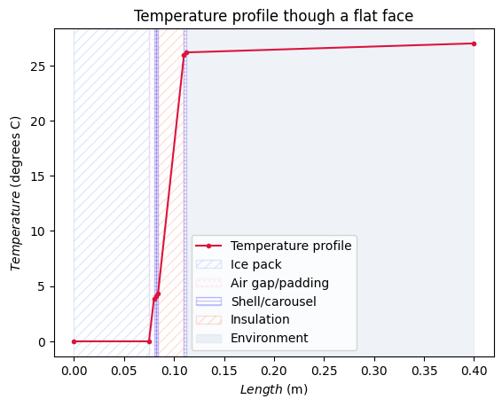
 The rate of heat transferred from the two flat faces is, **Q_dot_l = 0.912 J/s**.
The height of the mini smile with insulation thickness of 4cm is 22cm, so has a lightly greater improvement on the large smile in this dimension.

The temperature profile from the ice block to the rectangular walls, in a radial direction is shown below, with only conduction effects considered in the air gap.
 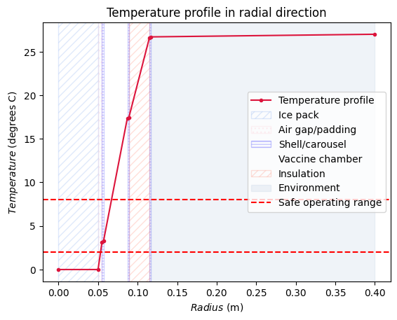
 The rate of heat transferred from the radial face is, **Q_dot_r = 1.156 J/s**.
The diameter of the small smile with 4cm insulation is approx. 23cm which is a reduction of 10cm from the large smile.

This shows the face limiting the cool life is the radial face as in the large model.
By approximating the box as the radial and linear resistor systems in parallel the total heat transferred out of the cooler is,
**Q_dot: 2.068 J/s** giving a cool life, with the vaccines below 8 degrees C, of **60.1 hours**.

### Upper bound for rate of heat transfer - assuming conduction and convection in air gap

The temperature profile from the ice block to the rectangular walls, in a radial direction is shown below, with convection effects now considered in the air gap as well as conduction.
 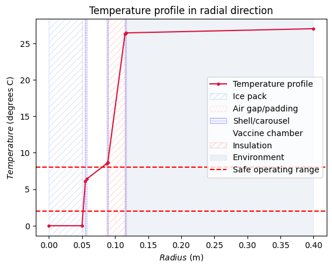
 The rate of heat transferred from the radial face is, **Q_dot_r = 2.220 J/s**.

The total heat transferred out of the cooler is, **Q_dot: 3.132 J/s** giving a cool life, with the vaccines below 8 degrees C, of **39.7 hours**.

This implies the true cool life of a small smile, with 2.6cm insulation in all directions, will lie between 39.7 hours < t < 60.1 hours. This suggests that the 2.6cm insulation would provide a sufficient cool life for the shorter and up to 24 hour last mile journeys.

The issue with this insulation thickness however, is its effect on the temperature range within the vaccine chamber. In the LB analyis of this small smile design, the average temperature of the vaccine chamber 10 degrees C whilst in the UB analysis the average temperature in the vaccine chamber is 7.5 degrees C which is within the desired range, but only just. In order to reduce the average temperature of this vaccine chamber wither the insulation could be thicker, or the thermal resistance between the ice pack and vaccines reduced. This second option is explored further in the following section.

# Effect of spacing between bottle and carousel 

Due to the shrinkage of the bottle as it melts, there cannot always be a snug fit between the ice pack and the carousel inner chamber. This results in an air gap when the ice pack is melted, as is shown in the image below, taken of the large smile inner chamber:
 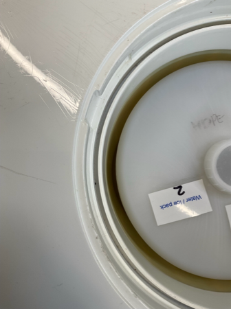
 The gap surrounding a fully melted ice pack in the large smile is 5mm surrounding the bottle. A similar gap both for expansion and manufacturing tolerance will be included in the design for the miniaturised smile.

Considering worst case scenario for the heating of the vaccines: we assume full contraction in a radial direction and no contraction in the londitudinal direction:
- On freezing the bottle will expand from 1 litre to 1.087 litres (approx 9% by vol) which results in a 4% radius increase. This space has been accounted for by a 5mm gap around the unexpanded bottle as it is likely the expansion will not be the same across the height of the bottle, so allows for more expansion at midsection.
- The new 1l ice pack was frozen to investigate the change in circumference which was found to only increase by 4mm. Most significant expansion was in centre of lid of the bottle, which bowed out by 3mm. A gap will therefore be left to allow longitudinal expansion.
- Other bottles may perform differently and expand more in a radial direction (also would be more significaant if the bottle was completely filled to the top of the neck) so a gap of 5mm will be left around the circumference to allow for this radial expansion.

The thermal properties of the materials in this gap are found to have a large impact on the temperature of the vaccine chamber.

The comparison for the temperature profile in a radial direction is shown for a gap filled with air (left) and a gap filled with a material with a higher thermal conductivity (i.e. silicon foam with a thermal conductivity of 0.3 W/mK):

Lower bound (for 3.5cm insulation) air gap:
 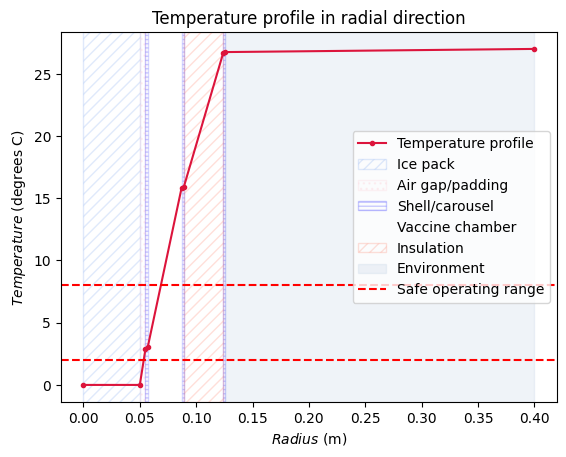

Upper bound (for 3.5cm insulation) air gap:
 

Lower bound (for 3.5cm insulation) foam gap:
 

Upper bound (for 3.5cm insulation) foam gap:
 

|Gap material|Thermal conductivity (W/mK)|Analysis type|Total heat transfer rate (J/s)|Cool time (hours)|avg chamber temperature (degrees C)|
|---|---|---|---|---|---|
|Air|0.2474|LB|1.850|67.1|10|
|||UB|2.730|45.5|6.5|
|Silicone foam|0.3|LB|1.973|62.9|7.5|
|||UB|3.154|39.4|2|

This investigation suggests the average chamber temperature for 3.5cm insulation, when the gap between ice pack and carousel is air filled, is **6.5 degrees C < T < 10 degrees C**. When the gap between ice pack and carousel is filled with conductive silicone foam, the average temperature of the vaccine chamber is **2 degrees C < T < 7.5 degrees C**. This shows that filling the gap with a conductive material is beneficial to making the temperature the vaccines will be stored at lie within the limits of 2 - 8 degrees C. The disadvantage of replacing the air gap with a thermaally conductive material is the increase in heat transfer rate to the smile box, resulting in a decrease in cool life. The upper bound analysis for the silicon foam filled gap gives a minimum cool time of 39.4 hours which is still sufficient for completing 24 hour last mile journeys. This suggests the benefits to the reduction in vaccine chamber temperature outweigh the loss of cool life for the specific project brief. 

Requirements for the material filling this gap are that it has a high thermal conductivity e.g. 0.3 W/mK, and a high compressibility to allow for bottle expansion and shrinkage. An investigation into potential materials is conducted below.

## Ice pack chamber gap material reseach

#### Thermally conductive silicone sponge 4.8mm thick
The full technical specification and sizing can be found at: https://therubbercompany.com/sponge-foam/silicone-sponge/thermally-conductive-silicone-sponge

 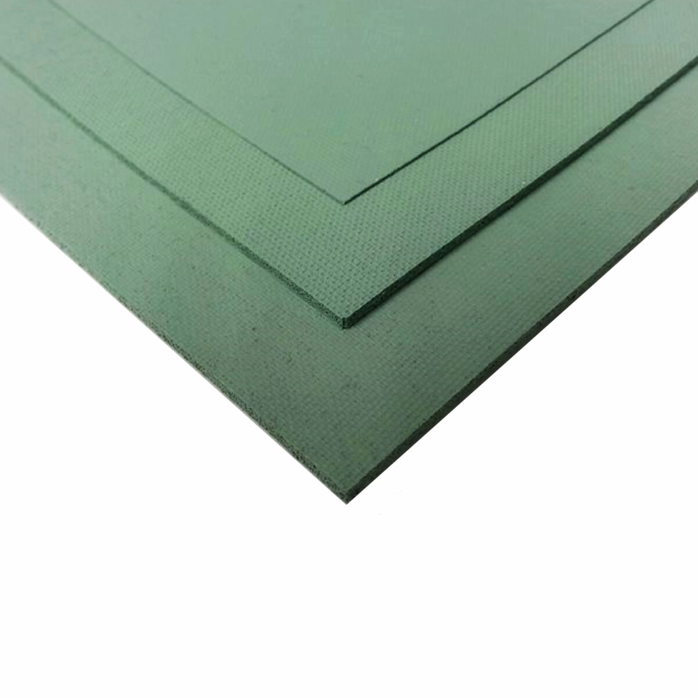

 Thermal properties depend on compression strain as follows:

|Compression|Thermal conductivity|
|----|----|
|Contact compression|0.30 W/mK|
|10% compression|0.40 W/mK|
|25% compression|0.45 W/mK|
|50% compression|0.65 W/mK|

As the radial dimension of the bottle does not increase significantly, it is expected that the thermal conductivity will increase to 0.40 W/mK at a maximum and reduce to 0.30 W/mK at a minimum, making this a well suited material to the task. THe material will be anisotropically compressed due to fitting around the cylindrical container so this should be taken into account for its effect on thermal properties. A quote would have to be obtained to find the price of this material and thus determine its viability as an option.

#### Highly compressible thermal gap pads 5mm thick
The full technical specification and sizing can be found at: https://therubbercompany.com/sponge-foam/silicone-sponge/thermally-conductive-silicone-sponge

 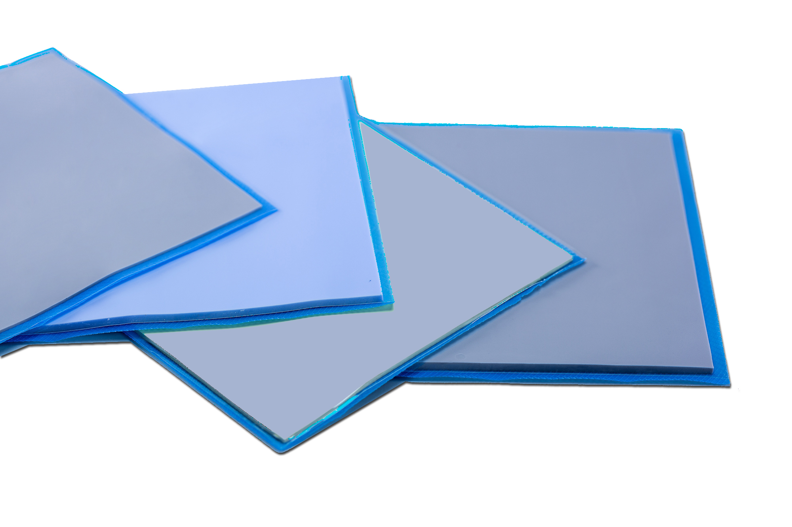

 The thermal conductivity of the pads is 1.5 W/mK. The sheet is naturally tacky, so easy to install on inside wall of chamber but could require protective fabric layer to prevent wearing from bottle moving in and out with each refil. A quote would have to be obtained to find the price of this material and thus determine its viability as an option.

#### ThermaCool R10404 closed cell silicone sponge 4.8mm thick
This is a thermally conductive closed-cell silicone sponge rubber. The product spefication can be found at: https://www.tapesolutions.saint-gobain.com/na/products/gasketing-foams/silicone/thermally-conductive-silicone/r10404

 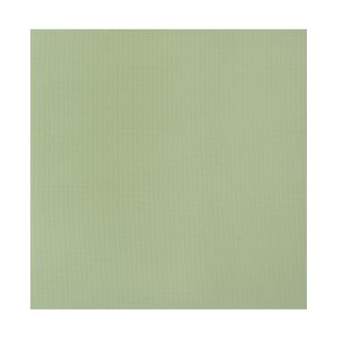

 Thermal properties depend on compression strain as follows:

|Compression|Thermal conductivity|
|----|----|
|10% compression|0.36 W/mK|
|30% compression|0.52 W/mK|
|50% compression|0.86 W/mK|

The closed call nature of this foam will help ptovide durability against the condensation from the ice pack. A quote would have to be obtained to find the price of this material and thus determine its viability as an option.

## Summary of findings

The materials considered have been considered independent of price, so to assess viability, quote would need to be obtained for all options. As well as reducing the temperature of the vaccine chamber, using a foam or sponge to fill the gap between ice pack and carousel inner wall, the potential for the bottle to move around in the chaamber is reduced as the stiffness of the foam will help to centre the bottle within the chamber. 

If the price of these materials or others with the compressibility and thermal conductivity requirements is too high to consider them for use in the small smile, the outer insulation can be made thicker as this also has the effect of reducing the temperature of the vaccine chamber as discussed eaarlier. 4cm thick radial insulation was found to maintain the vaccine chamber average temperature much closer to a value within the optimum range, so this could be used as an alternative at the loss of some overall size reduction.

